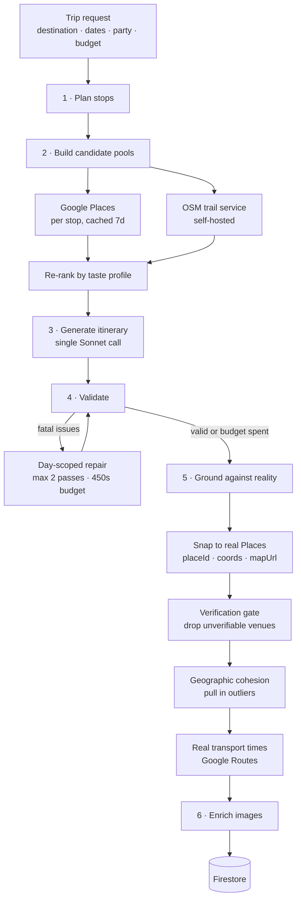

# Architecture

Wanderly generates complete, day-by-day travel itineraries from a short prompt, then lets
the traveler refine them conversationally. This document covers how that works — in
particular the generation pipeline, which is the part that carries the most design weight.

---

## The core problem

A language model will happily produce a beautiful, confident, completely fabricated
itinerary. It invents restaurants that closed in 2019, assigns coordinates that land in a
parking lot two towns over, and claims a 15-minute walk between places that are 40 minutes
apart. For a trip planner, those aren't cosmetic errors — a user standing on a street
corner in a foreign city is relying on the output being *true*.

So the pipeline treats the model as a **drafting engine, not a source of facts**. The LLM
decides structure, pacing, and narrative — what kind of day this should be, what goes
where, why it's worth doing. Every verifiable claim it makes is then either confirmed
against an authoritative source or removed before the user ever sees it.

---

## Generation pipeline



### 1 · Plan stops

Hub trips (one city) skip the LLM entirely — the destination *is* the stop. Multi-city
road trips call the model to choose a sensible route and allocate nights per stop.

### 2 · Build candidate pools

For each stop, in parallel: geocode it, pull a broad candidate pool from Google Places
(breakfast, food, nightlife, attractions, scenic), and fetch hiking trails from a
self-hosted OSM-derived service. Places results are cached in Firestore for 7 days, keyed
by destination + budget + interests, so repeat trips to the same city cost nothing.

The pools are then **re-ranked against the traveler's taste profile** before the model ever
sees them. This is where personalization actually happens: rather than asking the LLM to
"prefer hidden gems," the candidate list it receives is already ordered that way.

### 3 · Generate

One Sonnet call produces the entire itinerary via a structured tool schema — every day,
every activity, with times, descriptions, and categories. It picks from the real venues
supplied in step 2 rather than recalling places from training data.

When a trip is seeded from a prebuilt template, this step expands the seed's activities
instead of planning from scratch, preserving the curated shape while filling it out.

### 4 · Validate, then repair surgically

A deterministic validator checks structural rules the model reliably gets wrong:

- meals present in their real windows (breakfast 07:30–10:00, lunch 11:30–14:30, dinner 18:00–21:00)
- at least 7 activities per day, running until at least 20:30
- **at most one hike per day** — the model loves stacking three
- outdoor activities not scheduled after 15:00

Failures aren't handled by regenerating the whole trip. The validator reports *which days*
are broken, and only those days get a focused repair call. Repairs are capped at 2 attempts
and bounded by a 450-second wall-clock budget — past that, the trip ships best-effort
rather than hitting the function timeout. A slightly imperfect itinerary beats a spinner
that never resolves.

### 5 · Ground against reality

This is the anti-hallucination layer, and it runs in a deliberate order:

| Stage | What it does |
|---|---|
| **Reconcile** | Snap each activity to its real Google Place — authoritative `placeId`, coordinates, and map URL replace the model's guesses |
| **Verify** | Hard gate: any activity that can't be matched to a real Place or trail is dropped or replaced. A hallucinated venue cannot reach the user |
| **Cohesion** | Pull cross-city outliers back into the day's cluster, so one day never spans towns hours apart |
| **Transport** | Replace estimated travel times with real Google Routes data between the now-verified coordinates |
| **Drive legs** | For road trips, attach duration, distance, and an encoded polyline for the commute card |

Every stage is individually fault-tolerant: if Places is unreachable, the pipeline keeps
the previous best state and continues rather than failing the whole request.

### 6 · Enrich images

Photos are resolved server-side before the "your trip is ready" push fires, so the itinerary
is fully rendered the moment it's opened rather than popping in image by image.

---

## Conversational refinement

After generation, the traveler can restructure the trip in natural language — *"it's
raining today"*, *"we're tired"*, *"make this cheaper"* — or with one-tap refinements.

The model does **not** rewrite the itinerary. It emits a minimal set of structured
mutations (`replace_activity`, `remove_activity`, `reorder_day`), which are applied
deterministically. Two constraints keep this safe:

- **Day scoping** — mutations are clamped to the day being viewed, so "today" can't churn
  an unrelated day later in the trip.
- **Locked activities** — pinned items are excluded from mutation.

Every edit then re-runs the same grounding and enrichment passes from step 5, so a
conversationally-inserted venue is held to exactly the same verification standard as a
generated one.

Refinements run on Haiku rather than Sonnet: the task is small and structured, and the
latency difference is felt directly by a user waiting on a tap.

---

## Personalization

Taste is learned from three sources and merged into an effective profile:

1. **Swipe onboarding** — an explicit baseline from a card-swipe interest flow
2. **Learned drift** — signals extracted from what the user actually asks for, in the background
3. **Deterministic signals** — optimize-mode taps map directly to preference weights, no LLM needed

The profile's only job is re-ranking candidate pools before generation. Keeping
personalization *out* of the prompt and *in* the retrieval layer makes it debuggable —
you can inspect exactly which venues were promoted and why.

---

## System overview

**Client** — React Native (Expo, expo-router), Firebase Auth/Firestore, `react-native-maps`,
drag-to-reorder itineraries, RevenueCat for subscriptions.

**Backend** — ~19 Firebase Cloud Functions (Node 20). Generation is one long-running
endpoint; refinement, optimization, suggestions, and stop-rework are separate focused ones.

**Data** — Firestore holds users, itineraries, the Places cache, and prebuilt templates.

**External** — Anthropic (Sonnet for generation, Haiku for interactive edits), Google Places,
Google Routes, a self-hosted OSM trail service, Unsplash/Pexels for imagery.

---

## Running it in production

Cost and abuse controls, since this calls paid APIs on every generation:

- **Firebase App Check** on every function — requests must come from a genuine app binary
- **Per-user credits** — free tier gets 3 generations + 3 refinements/month; enforced server-side, never trusted from the client
- **Caching at every expensive layer** — Places results (Firestore, 7 days), replacement suggestions (in-memory, 15 min, with in-flight deduplication so a preload and a tap share one call)
- **Hard quota caps** on Places, plus a GCP budget alert as a backstop

A notable bug this surfaced: the itinerary screen preloads replacement suggestions for every
activity when a day opens, and the suggestion endpoint was charging a refinement credit per
call. A free user could exhaust their entire monthly allotment by *scrolling*, without ever
tapping anything. Credits are now charged on the confirmed mutation, while reads stay gated
but free.

---

## Testing

135 tests (Vitest) covering the pure, high-risk logic rather than UI scaffolding:

- place reconciliation and the verification gate
- mutation scoping (a day-scoped edit must not touch other days)
- schedule reflow and drive-day shaping
- itinerary validation rules
- directions URL precedence (`placeId` > name > coordinates)
- day insights (walking warnings, tight-schedule detection)

```bash
npm test
```
