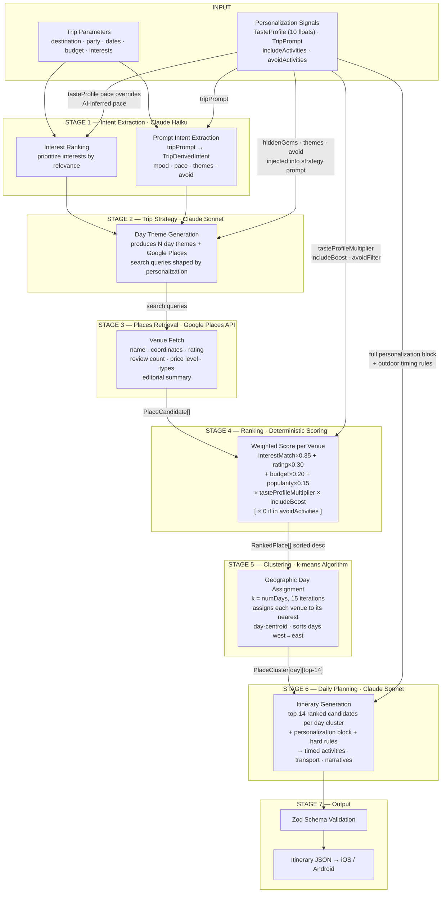

# Wanderly

AI-powered travel itinerary app for iOS and Android. Wanderly generates personalized day-by-day itineraries using a hybrid AI orchestration pipeline — real venue data from Google Places, scored and clustered by deterministic algorithms, then sequenced and narrated by Claude.

---

## AI Orchestration Pipeline

Itinerary generation runs through a **7-stage hybrid pipeline** on Firebase Cloud Functions. The design separates concerns cleanly: external APIs ground the output in real venues, algorithms handle scoring and geographic grouping deterministically, and LLM calls handle the parts that require judgment — trip shape, narrative, and combinatorial sequencing.



---

## Scoring Formula

Every venue retrieved from Google Places gets a deterministic score before Claude sees it.

```
baseScore =
    interestMatch  × 0.35   // does this venue match the user's interests?
  + rating         × 0.30   // Google rating normalized to 0–1 (rating / 5)
  + budgetFit      × 0.20   // price level vs. trip budget (penalty for overshoot)
  + popularity     × 0.15   // review count normalized at 5,000+

finalScore = baseScore
  × tasteProfileMultiplier   // tourist hotspots downweighted if hiddenGems > 0.5
  × includeBoost             // 1.5× for explicit must-include categories
  × avoidFilter              // 0 (hard remove) if category is in avoidActivities
```

**`tasteProfileMultiplier`** — if a venue is a tourist hotspot (types include `tourist_attraction` + >3,000 reviews), its score is scaled by `1 - (hiddenGems - 0.5) × 0.6`. A user with `hiddenGems = 0.9` sees popular tourist spots downweighted by ~24%.

---

## Personalization System

Four layers of personalization signals feed into the pipeline at different stages:

| Layer | Source | Lifetime | Injection Point |
|-------|--------|----------|-----------------|
| **Taste Profile** | 9-card swipe onboarding → 10 float dimensions | Long-term (user account) | Ranking multipliers · daily planning prompt |
| **Trip Prompt** | Freeform text, max 300 chars | Per-trip | Haiku → `TripDerivedIntent` → strategy + daily planning |
| **Include Activities** | Must-include pills at trip creation | Per-trip | `includeBoost 1.5×` in ranking · injected into daily planning prompt |
| **Avoid Activities** | Avoid pills at trip creation | Per-trip | Hard filter (score = 0) in ranking · excluded in daily planning |

**TasteProfile dimensions** (each 0.0 → 1.0):
`pace` · `foodie` · `nature` · `nightlife` · `hiddenGems` · `touristTolerance` · `walkingTolerance` · `structurePreference` · `adventure` · `luxury`

---

## Why Hybrid?

| Concern | Handled by |
|---------|-----------|
| Venue existence / accuracy | Google Places API |
| Interest relevance, budget fit, quality sorting | Deterministic scoring |
| Geographic coherence (days feel like areas, not zigzags) | k-means clustering |
| Trip shape, pacing, narrative, sequencing | Claude Sonnet |
| Fast structured extraction from freeform text | Claude Haiku |

Asking Claude to generate venues from scratch produces hallucinations and inconsistent quality. Running pure search-and-rank without an LLM produces itineraries that feel robotic and ignore context. The pipeline uses each tool for what it's best at.

---

## Stack

| Layer | Technology |
|-------|-----------|
| Mobile | React Native (Expo) · TypeScript |
| Navigation | React Navigation (stack) |
| Backend | Firebase Cloud Functions (Node.js · TypeScript) |
| Database | Firestore |
| Auth | Firebase Auth · Google Sign-In |
| AI | Anthropic Claude (`claude-sonnet-4-6` · `claude-haiku-4-5`) |
| Places | Google Places API |
| Purchases | RevenueCat |
| Notifications | Firebase Cloud Messaging |

---

## Project Structure

```
/
├── StickerSmash/          # React Native app (Expo)
│   ├── app/               # Screens (file-based routing)
│   ├── components/        # Shared UI components
│   ├── context/           # React context providers
│   ├── services/          # API clients (generateItinerary, purchases, etc.)
│   ├── utils/             # Helpers (cache, profile, onboarding storage)
│   └── types/             # Shared TypeScript types
│
└── functions/             # Firebase Cloud Functions
    └── src/
        ├── orchestration/
        │   ├── intentExtraction.ts   # Stage 1 — Haiku intent parsing
        │   ├── tripStrategy.ts       # Stage 2 — Sonnet strategy + queries
        │   ├── placesRetrieval.ts    # Stage 3 — Google Places fetch
        │   ├── ranking.ts            # Stage 4 — deterministic scoring
        │   ├── clustering.ts         # Stage 5 — k-means geographic grouping
        │   ├── dailyPlanning.ts      # Stage 6 — Sonnet itinerary generation
        │   └── types.ts              # Shared orchestration types
        └── itineraryGeneration.ts    # Pipeline entry point
```
