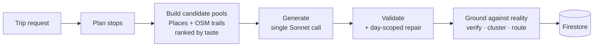

# Wanderly

**AI-powered travel planning for iOS and Android.** Describe a trip in a sentence and get a
complete, day-by-day itinerary built from real, verified venues — then reshape it by just
saying what you want changed.

https://github.com/user-attachments/assets/efee370b-62e1-4747-b981-27aa6044d97b

<p align="center">
  <a href="./ARCHITECTURE.md"><strong>Architecture &amp; AI pipeline →</strong></a>
</p>

---

## What it does

- **Generates full itineraries** — every day planned with real venues, realistic timing, and travel legs between them
- **Refines conversationally** — *"it's raining today"*, *"we're tired"*, *"make this cheaper"* restructure the day in place
- **Plans multi-city road trips** — routes stops, allocates nights, and builds the drive between cities with real duration and distance
- **Verifies hikes** — trail distance, difficulty, and duration come from OSM geometry, not from the model
- **Learns your taste** — a swipe-based profile plus learned signals reorder candidate venues before generation

---

## The interesting problem

A language model will confidently invent a restaurant, place it at coordinates in the wrong
town, and claim a 15-minute walk between points 40 minutes apart. For a trip planner that's
not a cosmetic bug — someone is standing on a street corner trusting the output.

So the pipeline treats the model as a **drafting engine, not a source of facts.** It decides
structure, pacing, and narrative. Every verifiable claim it makes is then confirmed against
an authoritative source or removed before the user sees it.



The grounding stage is where the guarantees come from: activities are snapped to real Google
Places, anything unverifiable is **dropped rather than shown**, cross-city outliers are pulled
back into the day, and travel times are replaced with real Google Routes data.

[Full architecture and pipeline detail →](./ARCHITECTURE.md)

---

## Stack

| Layer | Technology |
|---|---|
| Mobile | React Native (Expo) · TypeScript · expo-router |
| Backend | Firebase Cloud Functions (Node 20 · TypeScript) |
| Data | Firestore |
| Auth | Firebase Auth · Google Sign-In |
| AI | Claude Sonnet (generation) · Claude Haiku (interactive edits) |
| Geo | Google Places · Google Routes · self-hosted OSM trail service |
| Maps | react-native-maps |
| Purchases | RevenueCat |
| Notifications | Firebase Cloud Messaging |
| Integrity | Firebase App Check |

---

## Project structure

```
/
├── StickerSmash/              # React Native app (Expo)
│   ├── app/                   # Screens (file-based routing)
│   ├── components/            # UI — itinerary screen, sheets, trip builder
│   ├── context/               # Trip planning, saved trips, onboarding
│   ├── services/              # API clients (generate, regenerate, purchases)
│   ├── utils/                 # Itinerary helpers, insights, caching
│   └── test/                  # Client-side unit tests
│
└── functions/                 # Firebase Cloud Functions
    ├── src/
    │   ├── itineraryGeneration.ts   # Pipeline entry point + LLM calls
    │   ├── itinerarySchemas.ts      # Zod schemas / shared types
    │   ├── index.ts                 # HTTP endpoints, credits, App Check
    │   └── orchestration/
    │       ├── tripPlanning.ts         # Stop planning
    │       ├── contextBuilder.ts       # Candidate pool assembly
    │       ├── placesRetrieval.ts      # Google Places fetch
    │       ├── placesCache.ts          # 7-day Firestore cache
    │       ├── placeResolution.ts      # Snap to real Places + verification gate
    │       ├── placeQuality.ts         # Venue quality filtering
    │       ├── candidateScoring.ts     # Taste-profile re-ranking
    │       ├── trailDiscovery.ts       # OSM hiking trail lookup
    │       ├── directions.ts           # Google Routes enrichment + reflow
    │       ├── driveDayShaping.ts      # Multi-city travel days
    │       ├── stopRework.ts           # Swap / remove a city
    │       ├── validation.ts           # Structural rules + repair targeting
    │       ├── tasteProfileLearning.ts # Preference signal extraction
    │       ├── suggestionCache.ts      # TTL cache + in-flight dedupe
    │       └── imageEnrichment.ts      # Photo resolution
    └── test/                  # Backend unit tests
```

---

## Tests

135 tests covering the pure, high-risk logic — place reconciliation, mutation scoping,
validation rules, schedule reflow, directions URL precedence, and day insights.

```bash
npm test
```

---

## Running locally

```bash
cd StickerSmash
npm install
npm run ios      # builds the dev client (native modules — Expo Go won't work)
```

Requires a Firebase project, Anthropic and Google Places API keys, and
`GoogleService-Info.plist` for iOS.
